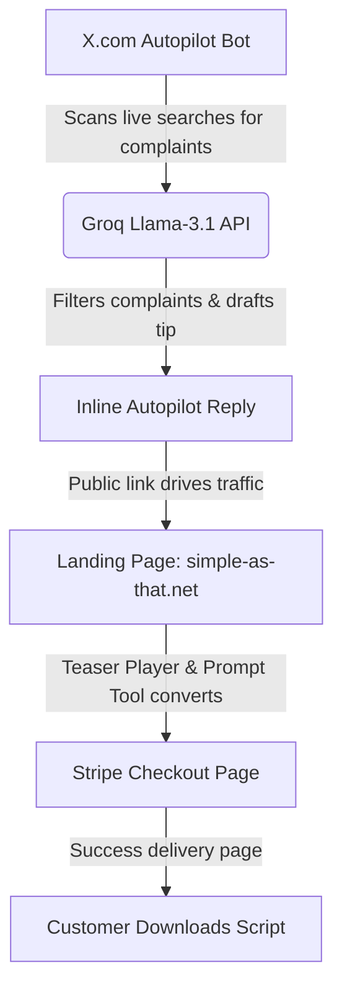

# SunoForge Omega: Complete System Guide

This document explains the architecture, components, and operations of the SunoForge Omega passive income system.

---

## 1. System Architecture (The Passive Income Funnel)

The system is designed to acquire leads, qualify them, present a high-value teaser demo, and collect payment completely on autopilot.

1. **Traffic Generation (Outreach):** The browser-based outreach agent scans X.com live searches for keywords like "suno quality" or "suno vocals".
2. **AI Qualification:** The agent passes each tweet to Groq (Llama-3.1). General song shares are discarded; actual user complaints are qualified as leads.
3. **Help-First Pitch:** Groq writes a brief, helpful tip (e.g. "extend at 0:01 with blank style") and appends a link to your landing page.
4. **Autonomous Reply:** The script clicks "Reply", types the text, and submits the post in-page, bypassing browser popup blockers.
5. **Conversion (Landing Page):** Visitors hit `simple-as-that.net`. They hear a clean audio demo comparing a standard song to a VNR Studio Master and play with a free prompt formatter.
6. **Monetization (Stripe):** Clicking the checkout link takes them to Stripe checkout ($29.00 USD). Upon successful payment, Stripe redirects them to a page to download the script.

---

## 2. Key Components & Code Files

### 🖥️ Component 1: The Landing Page (`index.astro`)
* **File Path:** `C:\Users\ovjup\Desktop\simple-as-that.net\src\pages\index.astro`
* **Purpose:** Serves as the primary homepage of your website.
* **Core Elements:**
  * **Teaser Demo:** Centered audio comparison playing `suno_teaser.mp3` (the Voss Studio quality demo).
  * **Sequence Optimizer Tool:** An interactive text formatting widget showing how VNR spacing and tagging works.
  * **Stripe Checkout Integration:** Button linking to your live Stripe payment page.

### 🛡️ Component 2: Suno Automation Script (`suno_automation_script.user.js`)
* **File Path:** `C:\Users\ovjup\Desktop\SUNO REVERSE ENGINEERING!\tampermonkey_scripts\suno_automation_script.user.js`
* **Purpose:** The actual product sold to customers. It runs on `suno.com` via Tampermonkey.
* **Core Elements:**
  * **VNR Performance Shield:** A MutationObserver running at `document-start` that intercepts and strips CPU/GPU-draining trackers (Microsoft Clarity, Tapad, Braze, Statsig, Amplitude, etc.).
  * **Step-by-Step UI Panel:** A neon floating GUI guiding users through the 6-step Studio Quality optimal path (automatically locks extend point at 0:01 and clears style tags during extension/cover mode passes).

### 🤖 Component 3: X Outreach Bot (`suno_x_marketing_assistant.user.js`)
* **File Path:** `C:\Users\ovjup\Desktop\SUNO REVERSE ENGINEERING!\tampermonkey_scripts\suno_x_marketing_assistant.user.js`
* **Purpose:** Drives passive traffic to the landing page. It runs on `x.com` via Tampermonkey.
* **Core Elements:**
  * **DOM-Based Interaction:** Automates actions directly inside your active browser tab (clicks reply, focuses the text box, types, and submits).
  * **API Connectivity:** Interacts with the Groq API utilizing your API key to qualify tweets and write contextual pitches.
  * **Status Panel:** Floating visual box showing real-time feedback (e.g. "Scanning visible tweets...", "Replying successfully to ID...").

---

## 3. How to Operate the Outreach Engine

To start generating traffic and driving sales:

1. **Verify Your Site is Live:** Check that your website is running at [simple-as-that.net](https://simple-as-that.net) (Vercel builds automatically on git pushes).
2. **Install the Marketing Assistant:**
   * Open Tampermonkey in your browser.
   * Click **Create a new script (+)**.
   * Paste the code from `suno_x_marketing_assistant.user.js` and save (`Ctrl + S`).
3. **Start the Loop on X.com:**
   * Open [x.com](https://x.com) (make sure you are logged into your account).
   * Click the blue **"Go to X Search Feed"** button on the bottom-left panel.
   * Toggle **"Autopilot (OFF)"** to **"Autopilot (ON)"**.
   * When the page requests external connections, click **"Allow Always"** to authorize access to `api.groq.com`.
4. **Let it Run:**
   * Leave the search tab open in your browser.
   * The script will scroll down, analyze tweets on-screen, and reply to qualified leads.
   * Your account's processed tweets list is saved locally in your browser's storage, preventing duplicate pitches.

---

## 4. Troubleshooting & Optimizations

* **Cloudflare/API Block warnings:** If your Groq key is ever revoked, the status box will output `API Error: HTTP 401`. You can replace the API key in the top of the script.
* **Manual Scroll:** The bot auto-scrolls down slowly. If you want to load new results faster, you can manually scroll down the search page, and the script will automatically pick up and process any new tweets that appear.
